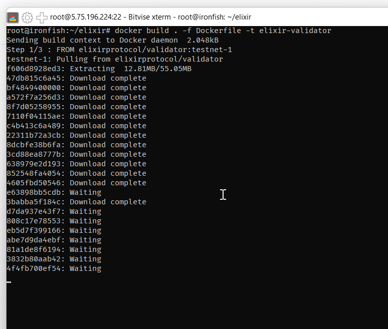
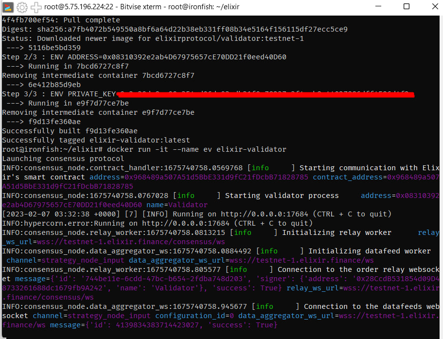

<p align="right">
<html>
   <body>
      <a href="https://t.me/detective_gems/">
         Join Channel Detective Gems  
      </a>
   </body>
</html>
</p>

#### Recommended hardware requirements

| Hardware |       Specs       |
| :------: | :---------------: |
|   CPU    |       2 CPU       |
|   RAM    |      4GB RAM      |
|   DISK   | 50 GB SSD STORAGE |
|    OS    | Ubuntu 20.04 LTS  |

#### Required ports :

- Exposed TCP port `17684` , make sure it's not occupied
  open port `17684`

```
apt install ufw -y
ufw allow ssh
ufw allow https
ufw allow http
ufw allow 17684
ufw enable
```

#### Prepare Metamask Account (Better Use Burner wallet)

1. Create new metamask/tokenpocket
   better using tokenpocket for take your private key
   save your private key to notepad like this


NOTE : your privatekey must be with 0x in front

2. Now go to your VPS , and login into terminal paste **required ports** above
3. and now lets input code for installing docker

```
curl -fsSL https://download.docker.com/linux/ubuntu/gpg | sudo gpg --dearmor -o /usr/share/keyrings/docker-archive-keyring.gpg
echo "deb [arch=$(dpkg --print-architecture) signed-by=/usr/share/keyrings/docker-archive-keyring.gpg] https://download.docker.com/linux/ubuntu \
$(lsb_release -cs) stable" | sudo tee /etc/apt/sources.list.d/docker.list > /dev/null
sudo apt-get update && sudo apt-get install docker-ce docker-ce-cli containerd.io docker-compose-plugin -y </dev/null && sudo chmod 666 /var/run/docker.sock
```

check your docker if installed with `docker -v`

4. Create elixir folder

```
mkdir elixir && cd elixir
```

5. And then you need setup you envirovment variable

NOTE :
You must change XXXX with your address
and change YYYY to your private keys

```
sudo tee Dockerfile > /dev/null <<EOF
FROM elixirprotocol/validator:testnet-1

ENV ADDRESS=XXXX
ENV PRIVATE_KEY=YYYY
EOF
```

example :


6. Install & configure screen

put this code

```
apt install screen -y
```

and then create screen with name elixir

```
screen -R "elixir"
```

_wait few moment till showing new screen_

7. Build the Docker image

```
docker build . -f Dockerfile -t elixir-validator
```



8. Start Validator

```
docker run -it --name ev elixir-validator
```



9. you can get exit screen by press `CTRL+A D`

10. You need register your nodes wallet to discord channel

- join discord elixir https://discord.gg/FP7kduD5Da
- verify ,then go to #whitelist channel


- connect twitter , follow and retweet this https://twitter.com/ElixirProtocol/status/1621621362401103872?s=20&t=OFaA_Kx4qk_3vObZYq1ysw
- connect wallet ,and then submit wallet ,check wallet
- if finished then showing like this


Additional commands :

- For checking logs

```
docker logs -f ev
```

Update version (do it on screen)

```
docker kill ev
docker rm ev
docker pull elixirprotocol/validator:testnet-1
docker build . -t elixir-validator
docker run -it --name ev elixir-validator
```

-=-=-=-=-=-=-=-=-=-=-=-=-=-=-=-=-=DONE=-=-=-=-=-=-=-=-=-=-=-=-=-=-=-=-=-
